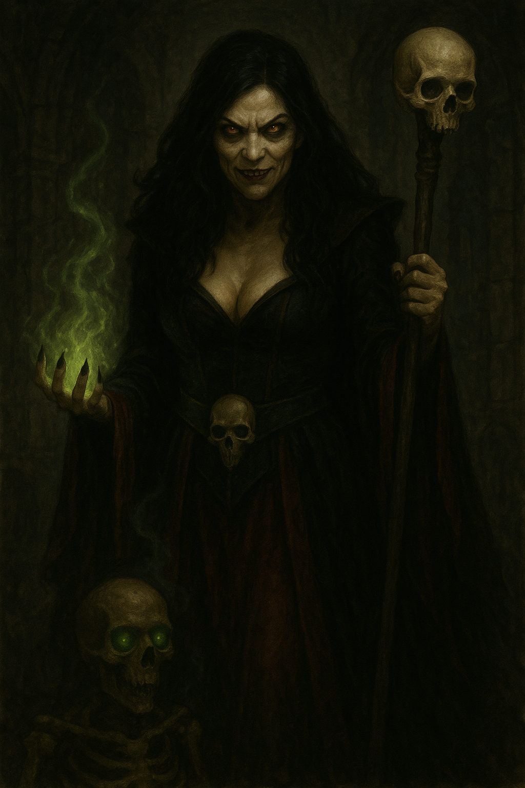

## Basic Information
- **Race:** Human
- **Class:** Necromancer
- **CR:** 8 (3,900 XP)
- **Alignment:** Neutral Evil
- **Voice:** Sustained/direct/strong, throaty placement, dry air, slow tempo, loud volume, aggressive tone


## Stats
```statblock
layout: Basic 5e Layout
image: "[[../Assets/Vorlag.png|Show to Players]]"
name: Vorlag the Pale
source: Characters
cr: 8
size: Medium
type: humanoid
subtype: human
alignment: neutral evil
ac: 12
hp: 99
hit_dice: 18d8 + 18
speed: "30 ft."
stats: [9, 14, 12, 18, 14, 16]
saves:
  - intelligence: 8
  - wisdom: 6
skillsaves:
  - arcana: 8
  - history: 8
  - insight: 6
  - religion: 8
damage_resistances: "necrotic"
senses: "passive Perception 12"
languages: "any four languages"
traits:
  - name: "Grim Harvest (1/Turn)"
    desc: "When the necromancer lord kills a creature that is not a construct or undead with a spell of 1st level or higher, the necromancer lord regains hit points equal to twice the spell's level, or three times if it is a necromancy spell."
  - name: "Spellcasting"
    desc: "The necromancer lord is a 12th-level spellcaster. Its spellcasting ability is Intelligence (spell save DC 16, +8 to hit with spell attacks)."
actions:
  - name: Withering Touch
    desc: "Melee Spell Attack: +8 to hit, reach 5 ft., one creature. Hit: 11 (2d10) necrotic damage."
legendary_actions:
  - name: "Cantrip"
    desc: "The necromancer lord casts a cantrip."
  - name: "Command Undead (Costs 2 Actions)"
    desc: "The necromancer lord magically commands one undead creature it can see within 60 feet of it. The target must succeed on a DC 16 Charisma saving throw or obey the necromancer's commands until the end of the necromancer's next turn."
  - name: "Disrupt Life (Costs 3 Actions)"
    desc: "Each non-undead creature within 20 feet of the necromancer lord must make a DC 16 Constitution saving throw, taking 21 (6d6) necrotic damage on a failed save, or half as much damage on a successful one."
spells:
  - The necromancer lord has the following wizard spells prepared
  - Cantrips (at will): chill touch, mage hand, prestidigitation, toll the dead
  - 1st level (4 slots): false life, mage armor, magic missile, ray of sickness
  - 2nd level (3 slots): blindness/deafness, ray of enfeeblement, web
  - 3rd level (3 slots): animate dead, counterspell, fear, vampiric touch
  - 4th level (3 slots): blight, dimension door, phantasmal killer
  - 5th level (2 slots): cloudkill, danse macabre
  - 6th level (1 slot): circle of death
```

## Items
* Staff of blackened bone
* Grimoire bound in flayed skin
* Decaying robes of once-fine silk
* **The Phalanx of Whispers** (stolen from [[The Ancestor Mounds]])
* Various necromantic components

## DM Notes & Key Info
**Primary Antagonist:** Responsible for cursing the player characters with [[The Death's Eye]]

**Role:** Devoted lieutenant to [[The Dusk Lord]], working to facilitate his return

**Campaign Purpose:** 
- Marks PCs as potential servants through cursing
- Uses them as unwitting agents to spread necromantic corruption
- Demonstrates growing power to allies and enemies

**Tactical Notes:**
- Patient and methodical planner
- Views PCs initially as annoyances but interest grows if they consistently thwart her
- Should have escape options in early encounters

## Description
**Physical Appearance:**
* Tall and gaunt figure
* Hypnotic but now twisted beauty
* Unnaturally pale skin stretched taut over bones
* Eyes that burn with cold amber light
* Draped in decaying robes of dark red, tattered silk
* Carries staff of blackened bone and skin-bound grimoire

### Character Assets
- **Portrait:** 

**Personality:**
* Arrogant and cruel with deep disdain for the living
* Convinced of the supremacy of undeath
* Patient and methodical in planning
* Views interference as personal insults to her authority

## History
**Broken Beginnings:** Born Lovgar Sunstone with skin pale as winter moonlight, she endured a childhood marked by abandonment and suffering. Orphaned at seven when plague claimed her parents, she was cast into the care of a brutal monastery where the overseers saw her ethereal beauty as both temptation and commodity. Her porcelain features and translucent skin drew unwanted touches from visiting nobles and merchants, while the jealous matrons punished her for attractions she neither sought nor understood. Beaten for being too beautiful, starved for being too proud, she learned that her ghostly pallor made her both valuable and reviled—a living reminder of death's touch that men desired and women feared.

**The Desperate Escape:** At sixteen, when the monastery's head priest attempted to sell her to a visiting lord as a "bride," Lovgar finally broke. She fled into the wilderness during a winter storm, preferring death to further degradation. For days she wandered, her pale skin nearly invisible against the snow, until exhaustion and exposure brought her to the edge of death. She collapsed in the ancient ruins where dark magic still lingered, her fading life force drawn to the necromantic energies that pulsed through the cursed stones. There, balanced between life and death, she lay dying when fate brought her salvation.

**The Savior's Shadow:** When [[Lysander Grimheart]] found her dying in ancient ruins, her pale beauty struck him like a vision—an angel fallen from grace, her alabaster skin almost luminous against the dark stones. He became her secret protector, enrolling her as a cleric of Ilmater while hiding her existence from his wife. But salvation came with its own torment—his infrequent visits left her yearning for the only person who had ever looked upon her pallid features with kindness rather than hunger. In the temple's cold halls, surrounded by prayers of suffering and mercy, she found little comfort in Ilmater's teachings.

**Shar's Whispered Promises:** The goddess of loss and darkness spoke to Lovgar's wounded heart where Ilmater's light could not reach. Shar understood abandonment, betrayal, the ache of unrequited devotion. In secret midnight prayers, Lovgar found solace in embracing the pain rather than seeking to heal it. Shar taught her that suffering was not meant to be endured—it was meant to be wielded.

**The Forbidden Knowledge:** When Lysander presented her with the indecipherable tome containing necromantic lore of [[The Dusk Lord]], Lovgar saw opportunity disguised as intellectual challenge. Already steeped in Shar's darker mysteries, she proved receptive to the ancient lich's whispered teachings that seeped from the cursed pages. The book became her gateway to power—power to never again be abandoned or helpless.

**The Ultimate Betrayal:** Years of growing resentment culminated in her desperate confession of love to Lysander. His gentle rejection shattered the last remnants of Lovgar Sunstone. In that moment of absolute despair, she enacted the ritual that would transform both their fates—binding him as her ghoul servant while completing her own metamorphosis into Vorlag the Pale. If he would never love her freely, he would serve her eternally.

**Servant of the Dusk Lord:** Through the forbidden tome's influence and her mastery of Shar's teachings, Vorlag attracted the attention of [[The Dusk Lord]] himself. The ancient lich recognized her potential and claimed her as his devoted lieutenant. In serving him, she found the purpose that had eluded her mortal life—to bring about a world where the abandoned and forgotten would rise to claim dominion over those who had scorned them.

**Current Mission:** Restore [[The Dusk Lord]] to power in the Material Plane

**Goals:**
- **Primary Goal:** Weaken barriers between Material Plane and Shadowfell within the Dalelands to facilitate her master's return
- **Immediate Goals:**
  * Claim strategic locations like [[Stillwater Creek - Village Index]] to anchor master's influence
  * Build undead army for Dusk Lord's initial forces
  * Eliminate or corrupt divine servants and regional threats
  * Study and exploit leyline convergences and planar weak points

**Methods:** The cursing of PCs with [[The Death's Eye]] serves multiple purposes: marking them as potential servants, using them as unwitting agents to spread necromantic corruption, and demonstrating her growing power.

## Relationships
**Master:** [[The Dusk Lord]] - Ancient lich she serves with absolute devotion

**Trusted Lieutenant:** [[Malachar Shadowbane]] - Former priest of Lolth, specializes in eliminating divine threats and corrupting holy sites

**Personal Bodyguard:** [[Lysander Grimheart]] - Corrupted former paladin who once served alongside her, represents her cruelest triumph

**Enemies:** Player characters cursed with [[The Death's Eye]], divine servants, regional authorities

## Quests
*Player-related quests involving this character will be tracked here.*
