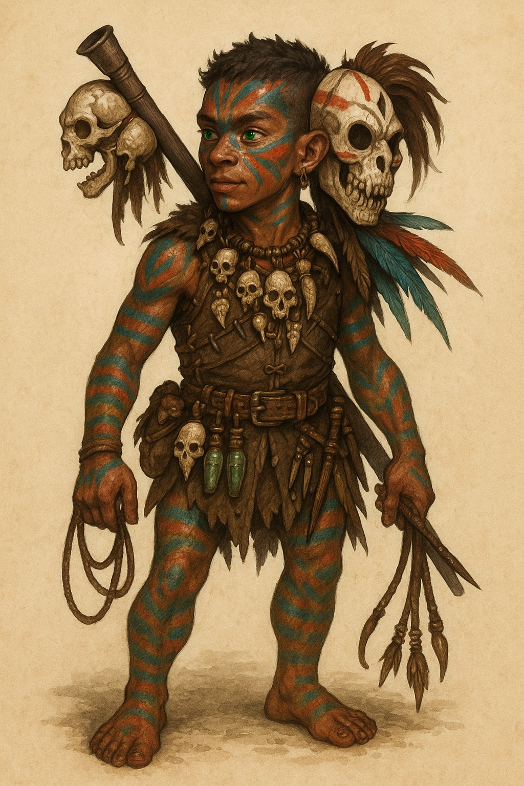

## General Information

- **Character Name:** Yuyu
- **Class & Level:** Ranger 1
- **Background:** Outlander
- **Race:** Stout Halfling
- **Alignment:** Chaotic Good
- **Experience Points:** 0
- **Inspiration Points:** 0

## Ability Scores

| Ability      | Score | Modifier |
| :----------- | :---: | :------: |
| STRENGTH     |  10   |    0     |
| DEXTERITY    |  17   |    +3    |
| CONSTITUTION |  14   |    +2    |
| INTELLIGENCE |  12   |    +1    |
| WISDOM       |  14   |    +2    |
| CHARISMA     |   8   |    -1    |

## Proficiencies

**Proficiency Bonus**: +3

- **Saving Throw Proficiencies:** Strength, Dexterity
- **Skill Proficiencies:** Athletics, Animal Handling, Perception, Survival
- **Armor:** Light armor, medium armor, shields
- **Weapons:** Simple weapons, martial weapons
- **Tools:** Pan flute, poison kit
- **Languages:** Common, Halfling, Orc

## Combat
- **Speed:** 25 ft. *(Note: 7.5m was on the original sheet, which is closer to 25 ft)*
- **Hit Dice:** 1d10
- **HP:** 12
- **AC:** 16

## Attacks
| Name           | Damage/Type             | Properties             |
| :------------- | :---------------------- | :--------------------- |
| Whip           | 1d4 Slashing            | Finesse, Reach         |
| Poison Blowgun | 1 Piercing + 1d4 Poison | Ammunition             |
| Dagger         | 1d4 Piercing            | Finesse, Light, Thrown |

## Spells

- **Spellcasting Ability:** Wisdom
- **Cantrips:** Guidance, Shillelagh
- **Known Spells:**
    - Speak with Animals

## Features & Traits

### Stout Halfling Traits
- **Lucky:** Can reroll a 1 on any attack roll, ability check, or saving throw.
- **Brave:** Advantage on saving throws against being Frightened.
- **Halfling Nimbleness:** Can move through the space of any creature that is of a size larger than yours.
- **Stout Resilience:** Advantage on saving throws against poison and resistance to poison damage.

### Ranger Features (Level 1)
- **Favored Enemy:** *Orcs and Humans*
- **Natural Explorer:** *Forest*

### Background Feature (Outlander)
- **Wanderer:** Excellent memory for maps and geography. Can find food and fresh water for yourself and up to five other people each day, provided the land supports it.

## Appearance & Personality

- **Personality Traits:** Very curious, Yuyu is a cheerful wildling, ignorant of all social codes. He speaks of himself in the third person, doesn't hesitate to shout his name or imitate animals. He draws inspiration from fauna and flora for combat.
- **Appearance:** Yuyu is a 22-year-old Stout Halfling (3 ft / 90 cm, 42 lbs / 19 kg). He has short brown hair, green eyes, and tan skin. He is often shirtless, his body covered in tribal paints. His messy hair is styled with feathers and bones. A frightening tribal mask is attached to the back of his head, and he wears trophies from his hunts as a necklace.

### Character Assets
- **Portrait:** 

## Backstory
Abandoned or lost by his family at age 6 during a game of hide-and-seek in the forest, Yuyu survived alone by surrounding himself with wild animals. After 10 years of solitary life, he left his forest to discover new species in the desert.

On the verge of death in the Anauroch desert, Yuyu was rescued by a weathered old goat that led him to an oasis. He noticed an ancient druidic amulet around the animal's neck just before it saved him again, this time from a band of orcs, by carrying him to a hidden canyon lair.

Inside the dusty, forgotten hideout, Yuyu found belongings that had not been touched for centuries. He pieced together the clues: the amulet, the ancient shelter, and the vague stories he'd heard from other travelers about a withered old elf who haunted the desert. Yuyu realized that this goat was in fact Elunar, the very same reclusive elf from the tales, who had lost himself to solitude and forgotten his own past.

Through his persistence, Yuyu helped the ancient elf remember who he was. In doing so, he helped Elunar reclaim his true form, awakening the long-lost druid from centuries of self-imposed exile, though his formidable powers had diminished with time.

## Equipment & Inventory
- Gold pouch: 5
- Leather armor (artisanal)
- Whip
- Blowgun
- Darts
- Poison kit
- Vials of poison
- Backpack
- Sleeping bag
- Staff
- Rope
- Hunting trap
- Traveler's clothes
